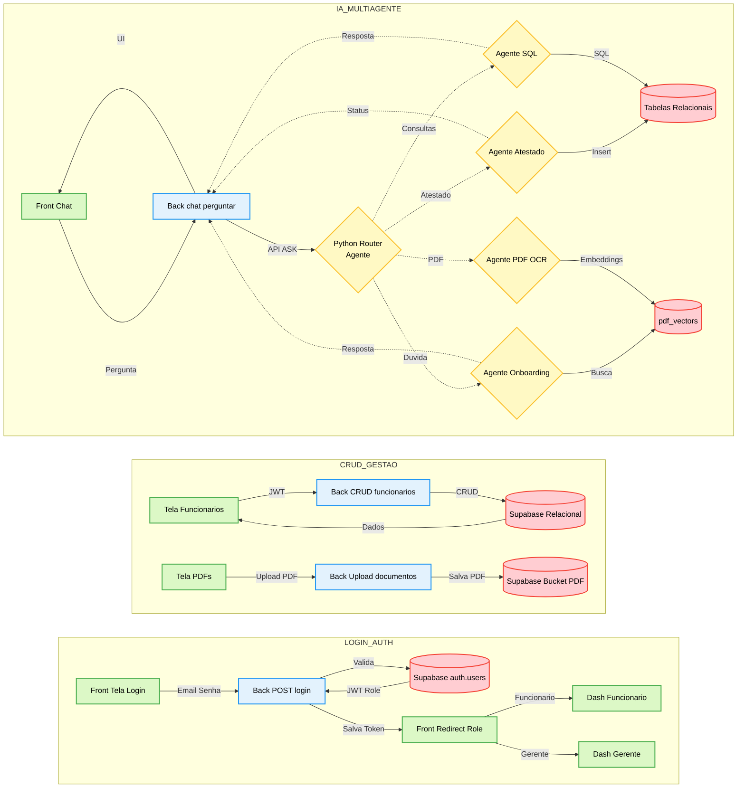

```mermaid
graph LR

%% CORES
classDef front fill:#dcf8c6,stroke:#4caf50,stroke-width:2px,color:#000;
classDef back fill:#e3f2fd,stroke:#2196f3,stroke-width:2px,color:#000;
classDef ia fill:#fff9c4,stroke:#fbc02d,stroke-width:2px,color:#000;
classDef db fill:#ffcdd2,stroke:#f44336,stroke-width:2px,color:#000;

%% =====================================================
%% BLOCO 1 LOGIN
%% =====================================================

subgraph LOGIN_AUTH
    direction LR

    L_Front["Front Tela Login"]:::front
    L_BackAuth["Back POST login"]:::back
    L_DB[("Supabase auth.users")]:::db
    L_Redirect["Front Redirect Role"]:::front

    L_Front -->|Email Senha| L_BackAuth
    L_BackAuth -->|Valida| L_DB
    L_DB -->|JWT Role| L_BackAuth
    L_BackAuth -->|Salva Token| L_Redirect

    L_Redirect -->|Funcionario| L_DashF["Dash Funcionario"]:::front
    L_Redirect -->|Gerente| L_DashG["Dash Gerente"]:::front
end

%% =====================================================
%% BLOCO 2 CRUD
%% =====================================================

subgraph CRUD_GESTAO
    direction LR

    T_MenuF["Tela Funcionarios"]:::front
    T_MenuP["Tela PDFs"]:::front

    T_RotasF["Back CRUD funcionarios"]:::back
    T_RotasP["Back Upload documentos"]:::back

    T_DB_Rel[("Supabase Relacional")]:::db
    T_DB_Bucket[("Supabase Bucket PDF")]:::db

    T_MenuF -->|JWT| T_RotasF
    T_RotasF -->|CRUD| T_DB_Rel
    T_DB_Rel -->|Dados| T_MenuF

    T_MenuP -->|Upload PDF| T_RotasP
    T_RotasP -->|Salva PDF| T_DB_Bucket
end

%% =====================================================
%% BLOCO 3 IA
%% =====================================================

subgraph IA_MULTIAGENTE
    direction LR

    C_Chat["Front Chat"]:::front
    C_Node["Back chat perguntar"]:::back

    C_Chat -->|Pergunta| C_Node

    C_Porteiro{"Python Router\nAgente"}:::ia

    C_Node -->|API ASK| C_Porteiro

    C_AgAtestado{"Agente Atestado"}:::ia
    C_AgOnboard{"Agente Onboarding"}:::ia
    C_AgPDF{"Agente PDF OCR"}:::ia
    C_AgCons{"Agente SQL"}:::ia

    C_Porteiro -.->|Atestado| C_AgAtestado
    C_Porteiro -.->|Duvida| C_AgOnboard
    C_Porteiro -.->|PDF| C_AgPDF
    C_Porteiro -.->|Consultas| C_AgCons

    C_DB_Vetores[("pdf_vectors")]:::db
    C_DB_Relacional[("Tabelas Relacionais")]:::db

    C_AgAtestado -->|Insert| C_DB_Relacional
    C_AgCons -->|SQL| C_DB_Relacional

    C_AgOnboard -->|Busca| C_DB_Vetores
    C_AgPDF -->|Embeddings| C_DB_Vetores

    C_AgOnboard -.->|Resposta| C_Node
    C_AgAtestado -.->|Status| C_Node
    C_AgCons -.->|Resposta| C_Node

    C_Node -->|UI| C_Chat
end
```